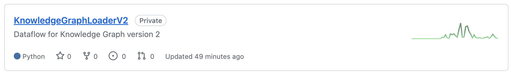
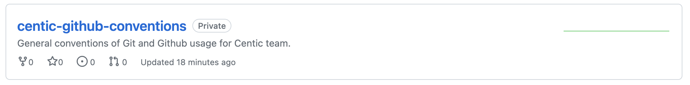
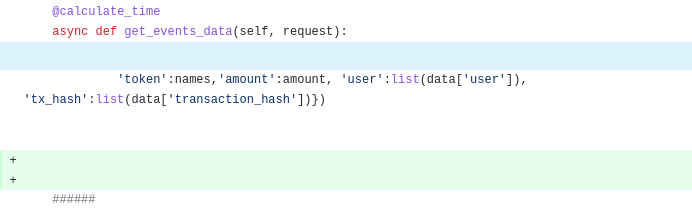

Table of Contents
=================

* [Repository](#repository)
* [Commit](#commit)
   * [Tính nguyên tử](#tính-nguyên-tử)
   * [Những thay đổi trong commit](#những-thay-đổi-trong-commit)
   * [Commit message](#commit-message)
* [Branch](#branch)
   * [Main Branches](#main-branches)
   * [Supporting Branches](#supporting-branches)
      * [Nhánh Feature](#nhánh-feature)
      * [Nhánh Issue](#nhánh-issue)
      * [Nhánh Hotfix](#nhánh-hotfix)

# Repository

Tên repository viết ở dạng KebabCase (các từ viết thường và cách nhau bởi '-'). Khi tạo mới phải viết description tóm tắt ngắn gọn tác dụng của repository.


Ví dụ:  
Không hợp lệ:  
****  
Hợp lệ:  
****

# Commit

## Tính nguyên tử

Mỗi commit chỉ nên hướng đến một mục đích, một đơn vị công việc cụ thể và đây được gọi là tính nguyên tử của commit.

Để đảm bảo tính nguyên tử cho commit, một **task** nên được chia thành các **meaningful-unit-of-work** nhỏ nhất có thể. Một cách hiểu khác của tính nguyên tử là phải đảm bảo cho phần mô tả của commit (`commit message`) nói về một công việc duy nhất mà không được nhắc đến bất kỳ công việc không liên quan khác.

## Những thay đổi trong commit

Với `python`, nếu cài thêm gói phụ thuộc mới vào project thì cần cập nhật vào `requirements.txt`.

Kiểm tra lại những thay đổi, không thêm import, ký tự và khoảng trắng vô nghĩa cho việc review code cũng như debug về sau khó khăn. Nếu việc thêm khoảng trắng, dòng mới nhằm tái cấu trúc giúp code dễ đọc hơn thì nên dành riêng một commit để format lại code.  
Ví dụ: Hai dòng mới không cần thiết được thêm trong commit  
****  

Những thông tin không được đưa lên Github (có thể đưa vào .gitignore):
- File biến môi trường: `.env` (chứa thông tin truy cập vào CSDL, provider, tokens …).
- File/folder được sinh ra bởi editor, IDE: `.vscode`, `.idea`,...
- Môi trường chạy của project: `venv`, `.venv`,... (dung lượng lớn).
- Thông tin nhạy cảm được fix trong code: thông tin kết nối đến CSDL, token, provider,...

## Commit message

Được Github coi như một file markdown, với đoạn đầu tiên là tóm tắt, các đoạn sau là mô tả chi tiết. Các đoạn cách nhau bởi một dòng trống.

Quy tắc:
- Không dài hơn 72 ký tự, mô tả ngắn gọn những thay đổi trong commit.
- Sử dụng câu mệnh lệnh ở thì hiện tại để viết tóm tắt commit. Ví dụ: 
  - “Add tests for” thay vì “I added tests for”.
  - “Change x to y” thay vì “Changed x to y”.
- Nội dung commit văn minh, lịch sự, không chứa từ ngữ bậy bạ, không liên quan đến chính trị, tôn giáo, không phân biệt chủng tộc, ...

Template cho commit message:
```
(Dưới 72 ký tự) tóm tắt thay đổi

Giải thích chi tiết hơn nếu cần. Cố gắng giữ trong 72 ký tự, nhiều hơn cũng được.

Một đoạn nữa sau một dòng trống.

- Có thể dùng gạch đầu dòng như markdown.

- Nội dung gì đó
```

# Branch

Tóm tắt:

<table>
  <thead>
    <tr>
      <th>Instance</th>
      <th>Branch</th>
      <th>Instructions</th>
    </tr>
  </thead>
  <tbody>
    <tr>
      <td>Stable</td>
      <td>main</td>
      <td>Chấp nhận merges từ Working và Hotfixes</td>
    </tr>
    <tr>
      <td>Working</td>
      <td>develop</td>
      <td>Chấp nhận merges từ Features/Issues và Hotfixes</td>
    </tr>
    <tr>
      <td>Features/Issues</td>
      <td>feature/*</td>
      <td>Luôn rẽ nhánh từ HEAD của Working</td>
    </tr>
    <tr>
      <td>Hotfix</td>
      <td>hotfix/*</td>
      <td>Luôn rẽ nhánh từ Stable</td>
    </tr>
  </tbody>
</table>

## Main Branches

Một repository sẽ luôn có hai nhánh sau:
- `main` (`master`)
- `develop`

****

`develop` (hay `origin/develop`) là nhánh mà `HEAD` của nó luôn chứa những chức năng mới nhất trong phiên bản ra mắt tiếp theo của sản phẩm, được phân nhánh từ `main` và sẽ phải nhập lại `main`.

`main` (hay `origin/main`) là nhánh chứa mã nguồn tương ứng với sản phẩm đang được chạy trên môi trường production.

Khi code trên nhánh `develop` chạy ổn định trên môi trường test, tất cả thay đổi sẽ phải merge lại nhánh `main` và tạo tag mới với release number tương ứng.

## Supporting Branches

Các nhánh hỗ trợ được sử dụng trong quá trình phát triển song song của các thành viên trong nhóm, là nơi mà ta sẽ code hằng ngày. Không như các nhánh chính ở trên, một nhánh hỗ trợ có vòng đời ngắn và sẽ bị xóa sau khi đã hoàn thành nhiệm vụ.

Các loại thường được sử dụng:
- Nhánh feature 
- Nhánh issue 
- Nhánh hotfix 

Mỗi nhánh này đều có một mục đích cụ thể và được ràng buộc với các quy tắc riêng.

### Nhánh Feature

Nhánh feature được sử dụng khi phát triển một tính năng mới hoặc cải tiến mới mà vòng đời phát triển của nó có thể lâu hơn một bản cập nhật của phần mềm. Tức là, khi mới bắt đầu phát triển tính năng mới này, không chắc chắn được tại phiên bản nào trong tương lai nó sẽ được ra mắt. Không quan trọng khi nào nhánh feature này kết thúc, nó sẽ luôn được merge về nhánh `develop`.

****

Trong vòng đời phát triển tính năng mới, người quản lý nhánh phải luôn để ý đến các commit mới ở `develop` kể từ khi rẽ nhánh. Bất kỳ thay đổi nào ở `develop` phải được merge vào nhánh mới trước khi được merge trở lại về `develop`.

Quy tắc:
- Phải rẽ nhánh từ: `develop`
- Phải merge vào: `develop`
- Quy tắc đặt tên: `feature/<id>`

**Quy trình làm việc với một nhánh `feature`**

Nếu nhánh chưa tồn tại, tạo nhánh mới trên local và đưa lên Github. 
```
$ git checkout -b feature/<id> develop
$ git push origin feature/<id>
```
 
Định kỳ kiểm tra các thay đổi từ `develop` (nếu có) và merge vào `feature`. Ít nhất phải merge tất cả các thay đổi từ `develop` trước khi merge `feature` trở lại `develop`.
```
$ git merge develop
```
Khi tính năng mới đã sẵn sàng, cần merge `feature` vào `develop`, sau đó xóa nhánh `feature` vừa được merge. Thao tác này phải được thực hiện bởi người quản lý repository hoặc có quyền chỉnh sửa trên `develop`. 
```
$ git checkout develop
$ git merge --no-ff feature/<id>
$ git push origin develop
$ git push origin :feature/<id>                    // deletes the remote branch
```

Với người không có quyền viết trên `develop` thì cần đưa code lên Github và tạo pull request.

### Nhánh Issue

Nhánh issue chỉ khác nhánh feature về mặt ngữ nghĩa. Nhánh này được tạo khi phần mềm xuất hiện vấn đề và vấn đề này cần được sửa vào bản cập nhật kế tiếp. Vì thế, vòng đời của nhánh issue không dài hơn một bản cập nhật của phần mềm. Không quan trọng khi nào nhánh này kết thúc, nó sẽ luôn được merge về nhánh `develop`.

Quy tắc:
- Phải rẽ nhánh từ: `develop`
- Phải merge vào: `develop`
- Quy tắc đặt tên: `issue/<id>`

**Quy trình làm việc với một nhánh `issue`**

Nếu nhánh chưa tồn tại, tạo nhánh mới trên local và đưa lên Github. 
```
$ git checkout -b issue/<id> develop
$ git push origin issue/<id>
```
 
Định kỳ kiểm tra các thay đổi từ `develop` (nếu có) và merge vào `issue`. Ít nhất phải merge tất cả các thay đổi từ `develop` trước khi merge `issue` trở lại `develop`.
```
$ git merge develop
```
Khi vấn đề đã được xử lý, cần merge `issue` vào `develop`, sau đó xóa nhánh `issue` vừa được merge. Thao tác này phải được thực hiện bởi người quản lý repository hoặc có quyền chỉnh sửa trên `develop`. 
```
$ git checkout develop
$ git merge --no-ff issue/<id>
$ git push origin develop
$ git push origin :issue/<id>                    // deletes the remote branch
```

Với người không có quyền viết trên `develop` thì cần đưa code lên Github và tạo pull request.

### Nhánh Hotfix

Nhánh hotfix được sử dụng khi phần mềm chạy trên môi trường production không như mong muốn và cần phải sửa ngay lập tức. Vì thế, nhánh hotfix sẽ luôn rẽ nhánh từ `main`.

****

Quy tắc:
- Phải rẽ nhánh từ: `main`
- Phải merge vào: `main` và `develop`
- Quy tắc đặt tên: `hotfix/<id>`

**Quy trình làm việc với một nhánh `hotfix`**

Nếu nhánh chưa tồn tại, tạo nhánh mới trên local và đưa lên Github. 

```
$ git checkout -b hotfix/<id> main
$ git push origin hotfix/<id>
```

Khi lỗi đã được sửa xong, Lead sẽ merge các thay đổi vào nhánh `main` và cập nhật tag mới.

```
$ git checkout main
$ git merge --no-ff hotfix/<id>
$ git tag -a <tag>                                  // tags the fix
$ git push origin main --tags                       // push tag changes
```

Merge những thay đổi vào cả `develop` để không bị lỡ bản sửa lỗi và sau đó xóa nhánh `hotfix`.

```
$ git checkout develop                                // change to the master branch
$ git merge --no-ff hotfix/<id>                       // forces creation of commit object during merge
$ git push origin develop                             // push merge changes
$ git push origin :hotfix/<id>                        // deletes the remote branch
```
